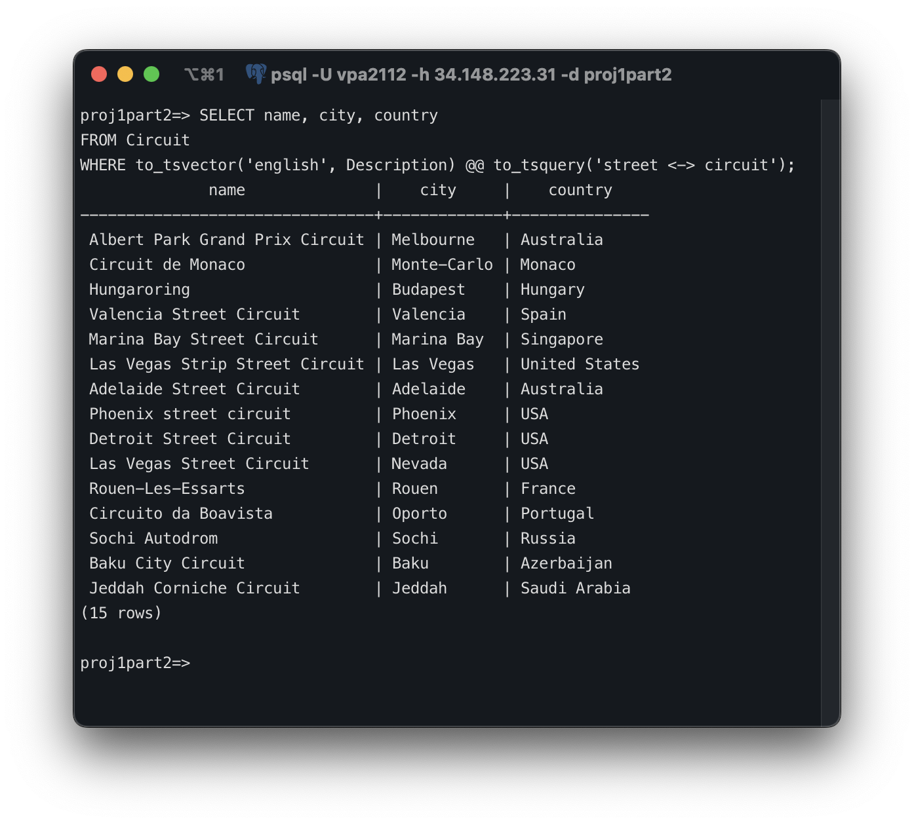
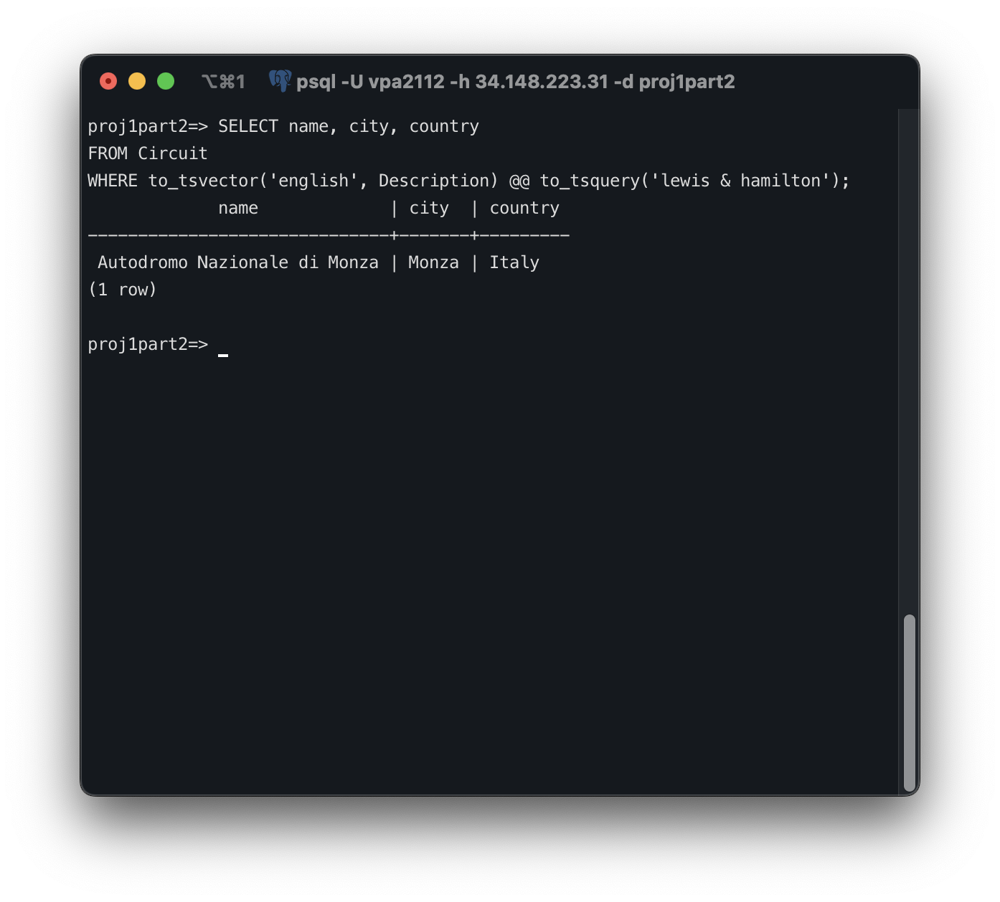
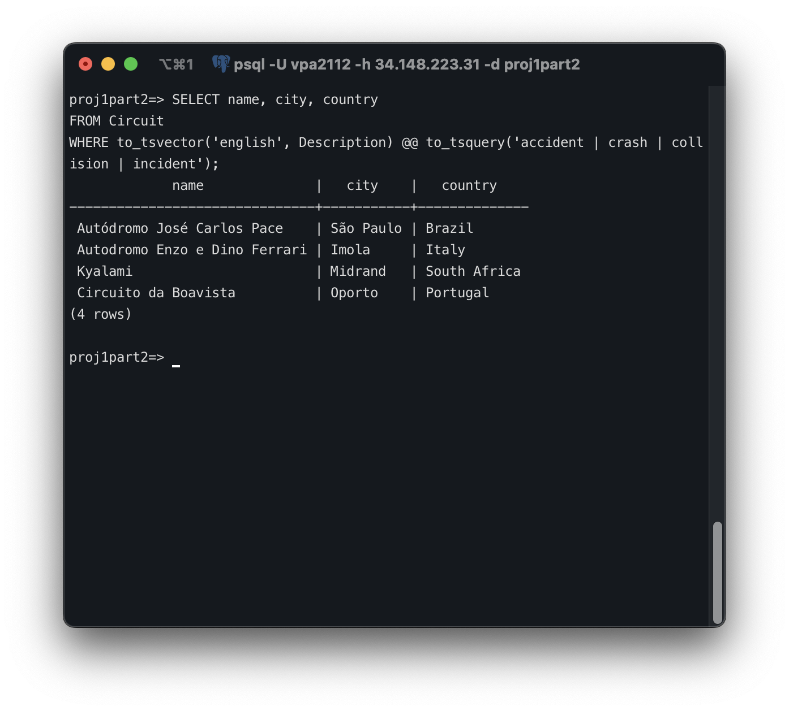

# Project Part 4 - Expansion of `slipstream`

| Name            | UNI      |
|-----------------|----------|
| Vishesh Arora   | vpa2112  |
| Vishruth Devan  | vd2461   |

---

## PostgreSQL Information

Account Name: vpa2112

---

## Full-Text Search Extension: Text Attribute Integration

To enhance the analytical capabilities of our database and enable natural language querying, we introduced a `Description` field to the `Circuit` table. This addition plays a crucial role in supporting full-text search, allowing us to extract meaningful insights from unstructured data.

### Schema Modification Rationale

1. **Addition of a `Description` Column:**  
   We extended the `Circuit` table with a `TEXT` column named `Description`. This field is intended to hold rich, paragraph-style textual content that describes each circuit in detail. Our choice aligns with full-text search best practices, where the target attribute should resemble document-style data rather than short strings or identifiers.

2. **Data Sourcing:**  
   The content for each circuit’s `Description` was programmatically gathered using a Python script that scrapes the introductory paragraph from each circuit’s corresponding Wikipedia page. This ensures that the data is informative, standardized, and relevant for natural-language querying.

3. **Use of Full-Text Search (FTS):**  
   To enable efficient and flexible text-based querying, we created a GIN (Generalized Inverted Index) on the `Description` column. This supports advanced search capabilities such as proximity matching, phrase detection, and synonym expansion, all of which are useful for our project’s querying needs.

### SQL to Add New Column

```sql
ALTER TABLE Circuit
ADD COLUMN Description TEXT;
```

### Creating a Full-Text Search Index

```sql
CREATE INDEX idx_circuit_description_fts
ON Circuit
USING GIN (to_tsvector('english', Description));
```

### Example Queries Using Full-Text Search

With the new `Description` column and full-text search index in place, we can now run powerful semantic queries. Below are three representative examples that demonstrate the value of this integration:

1. Retrieve Street Circuits
   This query finds circuits described explicitly as “street circuits”, using the `<->` operator to enforce that the words "street" and "circuit" appear directly next to each other.

```sql
SELECT name, city, country
FROM Circuit
WHERE to_tsvector('english', Description) @@ to_tsquery('street <-> circuit');
```



2. Find Circuits Mentioning Lewis Hamilton
   This query identifies circuits where Lewis Hamilton is a notable figure, based on mentions of his name in the circuit description. This could reflect historical significance or iconic performances.

```sql
SELECT name, city, country
FROM Circuit
WHERE to_tsvector('english', Description) @@ to_tsquery('lewis & hamilton');
```



3. Identify Circuits with Accidents
   This query returns circuits where accidents are a notable part of their history, based on keywords such as “accident,” “crash,” “collision,” or “incident” in the description.

```sql
SELECT name, city, country
FROM Circuit
WHERE to_tsvector('english', Description) @@ to_tsquery('accident | crash | collision | incident');
```



### Summary

This enhancement aligns with the project's broader goal of analyzing circuits beyond just their geographic and technical attributes. By integrating natural language data, we enable richer, more nuanced queries that can surface historical context, driver relevance, and safety characteristics — all of which are central to understanding circuit significance in the world of motorsports.

---

## Trigger to Prevent Driver Number Conflicts

In order to maintain data integrity and enforce a key business rule — that no two drivers in the same Formula 1 season can share the same driver number — we implemented a trigger on the `SeasonStandings` table. This trigger ensures that each driver number is unique within a given year, preventing accidental conflicts during data entry or updates.

### Why This Trigger Is Necessary

In Formula 1, each driver selects a permanent race number, and no two active drivers can use the same number in the same season. Our schema includes a `Driver` table with each driver's number and a `SeasonStandings` table that associates drivers with specific seasons. However, without additional constraints, it would be possible for two different drivers to be associated with the same number in a given year. This trigger prevents that.

### PL/pgSQL Function Definition

This function checks whether a different driver already uses the same number in the same season. If so, it raises an exception to prevent the insert or update.

```sql
CREATE FUNCTION check_driver_number_conflict()
RETURNS TRIGGER AS $$
DECLARE
    new_driver_number INT;
BEGIN
    -- Get the number of the driver being added/updated
    SELECT Number INTO new_driver_number
    FROM Driver
    WHERE DriverID = NEW.DriverID;

    -- Check for any other driver in the same season with the same number
    IF EXISTS (
        SELECT 1
        FROM SeasonStandings ss
        JOIN Driver d ON ss.DriverID = d.DriverID
        WHERE ss.Year = NEW.Year
          AND d.Number = new_driver_number
          AND ss.DriverID != NEW.DriverID
    ) THEN
        RAISE EXCEPTION 'Driver number conflict: Another driver already has number % in season %', new_driver_number, NEW.Year;
    END IF;

    RETURN NEW;
END;
$$ LANGUAGE plpgsql;
```

### Trigger Definition

We attach the above function as a `BEFORE INSERT OR UPDATE` trigger on the `SeasonStandings` table:

```sql
CREATE TRIGGER trg_check_driver_number_conflict
BEFORE INSERT OR UPDATE ON SeasonStandings
FOR EACH ROW
EXECUTE FUNCTION check_driver_number_conflict();
```

### Example Scenario: Trigger in Action

Let’s walk through a real example where this trigger prevents a conflict.

#### Setup

We have the following entry in the `Driver` table:

| driverid | firstname | lastname | number | nationality | dob        |
| -------- | --------- | -------- | ------ | ----------- | ---------- |
| 1        | Lewis     | Hamilton | 44     | British     | 1985-01-07 |

Creating two new drivers in the Driver table as follows:

```sql
INSERT INTO Driver (driverid, firstname, lastname, number, nationality, dob) VALUES
(999, 'Vishruth', 'Devan', 45, 'Indian', '2003-09-23'),
(998, 'Vishesh', 'Arora', 44, 'Singaporean?', '2003-09-23');
```

#### SQL Insert Statement

Now assume we add Vishruth Devan to the 2024 standings:

```sql
INSERT INTO SeasonStandings (DriverID, ConstructorID, Year, Points, Rank)
VALUES (999,  1, 2024, 300, 1);
```

This succeeds — no conflicts exist yet.

#### Conflict Attempt

Now we try to insert Vishesh Arora into the same season:

```sql
INSERT INTO SeasonStandings (DriverID, ConstructorID, Year, Points, Rank)
VALUES (998,  1, 2024, 300, 1);
```

#### Behind the Scenes

The trigger is activated before the insert. The function looks up Vishesh's number (`44`) and checks whether any other driver in the 2024 standings already uses that number. It finds Lewis Hamilton (already entered with number `44`), and raises this exception:

```a
ERROR:  Driver number conflict: Another driver already has number 44 in season 2024
```

As a result, the insertion fails and the integrity of the data is preserved.

### Summary

This trigger enforces a critical rule automatically at the database level, ensuring consistent and accurate data regardless of application-layer checks. It guards against accidental entry of duplicate driver numbers within the same season and contributes to the overall reliability of the project.
